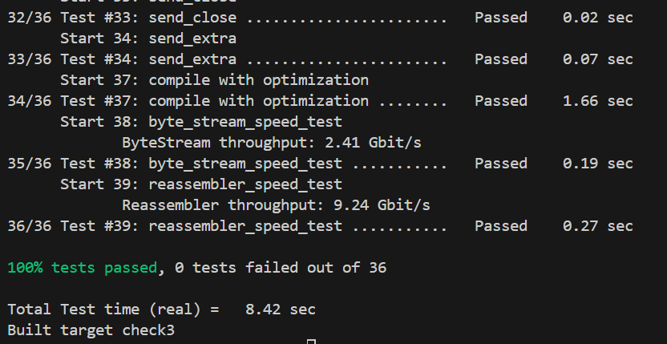

Checkpoint 3 Writeup
====================

My name: 翟竞波

My SUNet ID: 522024330117

This checkpoint took me about 2 hours to do. I did not attend the lab session.

#### 1. Program Structure and Design:

我将 `Timer` 的功能在辅助类中实现。
```C++
class Timer{
private:
  size_t _current_time{0};
  size_t _current_tout{0};
  bool status{false};
public:
  void shutdown();
  void start(unsigned int timeout);
  void update(size_t uptime);
  bool trip();
  bool state();
}
```
在 `TCPSender` 中，我用了两个标志位 `_syn_sent`、`_fin_sent` 指示状态（如实验讲义所示），另外添加了 `_retrans_cnt` 指示重传次数。
各方法均按讲义描述实现，具体内容将在下一节中展示。
#### 2. Implementation Challenges:

`fill_window()`：先获取当前能发送的字节长度，然后依次填满。最后启动定时器。
第一个 bug 在于，我最初的实现中，直接填满当前的 `window_size`，而实际上发送队列不一定是空的，导致测试中部分数据丢失。另外，由于 `bytes_in_flight()` 的返回值是 `uint64_t`，直接相减会导致 `remain_size` 为极大的正数。
另外，在填充 payload 时需使用 `move()` 转换为右值表达式。

`ack_recieved()`：先计算出 index，然后丢弃所有被确认的包，最后重置计时器。
我没有对不合法的 ACK（如实际未发送的包，可能是 ACK 损坏）做出处理，而是直接丢弃并返回，不知道这种处理是否会在之后遇到问题。（之后可能会改为 `assert()`）
对于最后计时器的处理，我选择先 shutdown，然后调用 `fill_window()`，在其中决定是否重新启动。

讲义的内容与教材中 TCP 的结构有部分不一致，这里还是以讲义为准（否则无法通过测试）。

一个令人困惑的点是，由于我在最初的实现中 `ByteStream::writer` 如果已经设置的 `error`，将会忽略所有写入信息。因此无法通过测试 `send_extra`。在做出修改后通过。

#### 3. Remaining Bugs:

我已通过所有测试点。



- Optional: I had unexpected difficulty with: [describe]

- Optional: I think you could make this lab better by: [describe]

- Optional: I was surprised by: [describe]

- Optional: I'm not sure about: [describe]
