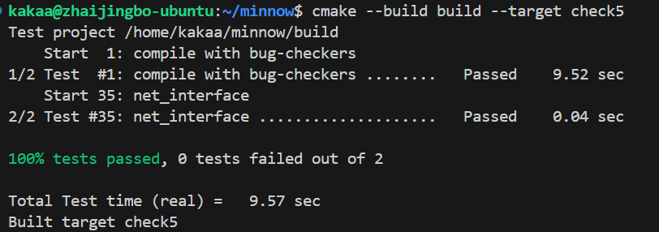

Checkpoint 5 Writeup
====================

My name: 翟竞波

My Student number : 522024330117

This lab took me about 4 hours to do. I did attend the lab session.


#### 1. Program Structure and Design:

```C++
struct arp_member {
        EthernetAddress addr;
        size_t life;
    };
    //_arp_table[ip]=birthtime;
    std::unordered_map<uint32_t, arp_member> _arp_table{};
    // _waiting_list[ip]=birthtime;
    std::unordered_map<uint32_t, size_t> _waiting_list{};
    std::vector<std::pair<Address, InternetDatagram>> _frame_buffer{};
    size_t _timer{0};
```
采用了上述三个容器分别储存 ARP 表（IP 地址，{ MAC，存在时间 } ）；等待 ARP 返回的表（IP 地址，发送时间）；缓存的未发送的帧（IP 地址，网络层数据）。

构造了内联函数 `ARP_Request(uint32_t ip)` 来构建 ARP 查询帧。

三个函数基本基于手册和规范实现。

#### 2. Implementation Challenges:

本次实验难度不大，大部分时间花费在理解手册上。ARP 协议比较简单，仅涉及链路层和部分网络层内容，和计算机网络其它部分耦合性低；这样的设计不仅利于软件的开发、优化，也为硬件加速提供了可能。

#### 3. Remaining Bugs:


由于测试了 route，这张截图是完成 lab7 后的状态。

效率应该也是最优。更好的方法是查表转发的过程全部通过硬件实现，就和现在真实的交换机一样。


