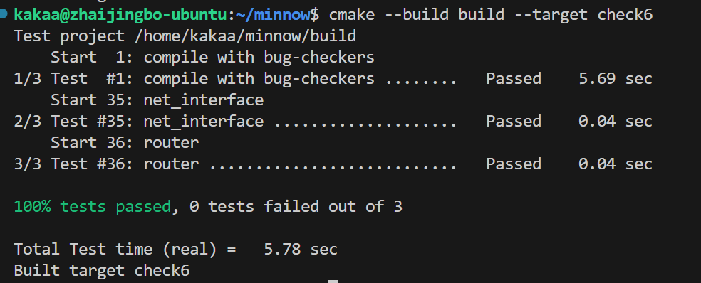

Checkpoint 6 Writeup
====================


My name: 翟竞波

My Student number : 522024330117

This lab took me about 3 hours to do. I did attend the lab session.

#### 1. Program Structure and Design:

```C++
struct route_member{
        uint8_t prefix_len{0};
        size_t interface_num{0};
        std::optional<Address> next_hop{std::nullopt};
    };
std::unordered_map<uint32_t,route_member>_route_table{};
```
采用如上所示的转发表。

`Router::add_route()` 根据输入参数创建新的表项并加入转发表。

`Router::route_one_datagram()` 遍历转发表找到其下一跳并发送。

#### 2. Implementation Challenges:

主要困难在于 debug。这次实验没有创建 ctest，因此逐步调试比较麻烦。关键还是在于读懂测试内容。讲义中的 testing 部分的图提供了很大帮助。

在添加转发表项时，根据最长前缀匹配的规则，可能会存在对之前存在的表项的覆盖（而不是添加）

另一个 C++ 的特性，`0xffffffff << 32 == 0xffffffff`, 而不是 `0`.


#### 3. Remaining Bugs:

我已完成全部实验内容。

实现了路由转发的时间复杂度 O(n)，考虑进一步提升至 O(lg n)，可以将 IP 作为 INT32 类型数据，在容器中顺序排列，考虑二分查找。

查询相关文档和源码，发现 Linux Kernel 的 IP 路由表用的是 Radix 树。
